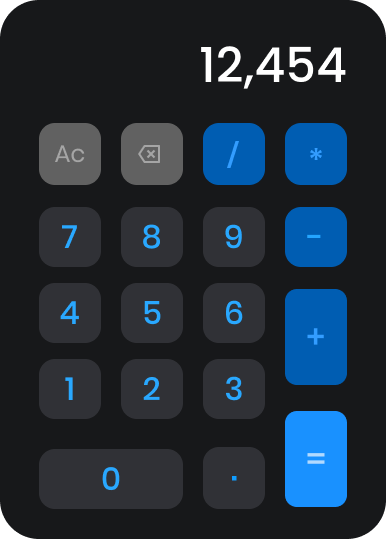

# 🚀 Desafio #1: A Super Calculadora Web

🎉 Este é o seu primeiro grande passo na jornada para se tornar uma desenvolvedora web incrível. Você já domina o básico de HTML e CSS, e agora é hora de dar vida às suas criações com **JavaScript**.

O objetivo deste desafio é transformar um design estático em uma calculadora totalmente funcional que roda no seu navegador. Você já sabe criar o visual; agora, você vai criar o "cérebro".

## 🎯 O Que Vamos Construir?

O seu primeiro projeto é recriar, com total precisão visual e funcionalidade, a calculadora mostrada abaixo:

  

_(Nota: Use a imagem de referência fornecida para guiar o seu design)_

## 📚 O Que Você Já Sabe vs. O Que Você Vai Aprender

- **O que você já sabe:**
  - Estruturar páginas com `<html>`, `<head>`, `<body>`.
  - Criar botões (`<button>`) e recipientes (`
`).
  - Estilizar com CSS (cores, bordas arredondadas e alinhamento).
- **O que você VAI APRENDER e USAR:**
  - **JavaScript:** A lógica de programação por trás dos botões.
  - **Manipulação do DOM:** Como o JS "conversa" com o seu HTML para mudar o texto do visor.
  - **Eventos de Clique:** Fazer o computador entender e reagir quando você clica em um botão.
  - **Operações Matemáticas:** Lidar com somas, subtrações e o fluxo de cálculo.

## 📋 Critérios de Aceite (Checklist)

Para o projeto estar pronto, ele deve cumprir estes requisitos:

### 🎨 Visual (Fiel ao Design)

1.  **Cores:** Fundo escuro, botões numéricos em cinza escuro, operadores em azul.
2.  **Layout:** O botão `0` deve ser mais largo e o botão `=` deve ser mais alto (ocupando o espaço de dois botões na vertical).
3.  **Estilo:** Bordas bem arredondadas nos botões e no corpo da calculadora.

### 🧠 Funcionalidade (O Coração do Projeto)

4.  **Digitação:** Ao clicar nos números, eles devem aparecer no visor.
5.  **Formatação:** Números grandes devem ter separador de milhar (ex: `12,454`).
6.  **Operações:** Deve somar, subtrair, multiplicar e dividir corretamente.
7.  **Botão AC:** Deve limpar tudo e resetar o visor para zero.
8.  **Botão Backspace (⌫):** Deve apagar apenas o último dígito digitado.
9.  **Decimal:** O botão de ponto deve funcionar corretamente para números decimais.

---

## 🚀 Como Começar

1.  **HTML:** Monte a grade (grid) de botões primeiro.
2.  **CSS:** Deixe ela idêntica à imagem. Use `border-radius` e `display: grid` para facilitar.
3.  **JS:** Comece capturando o clique de um número e exibindo no `console.log()` para testar.

Bom código, Você vai arrasar! 💻✨
